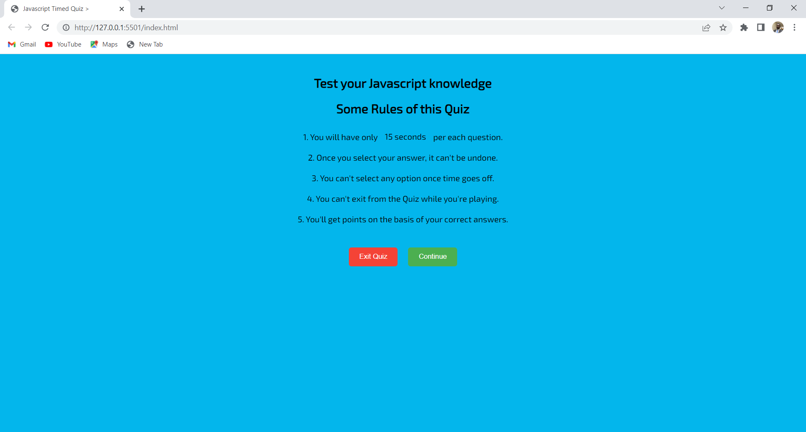
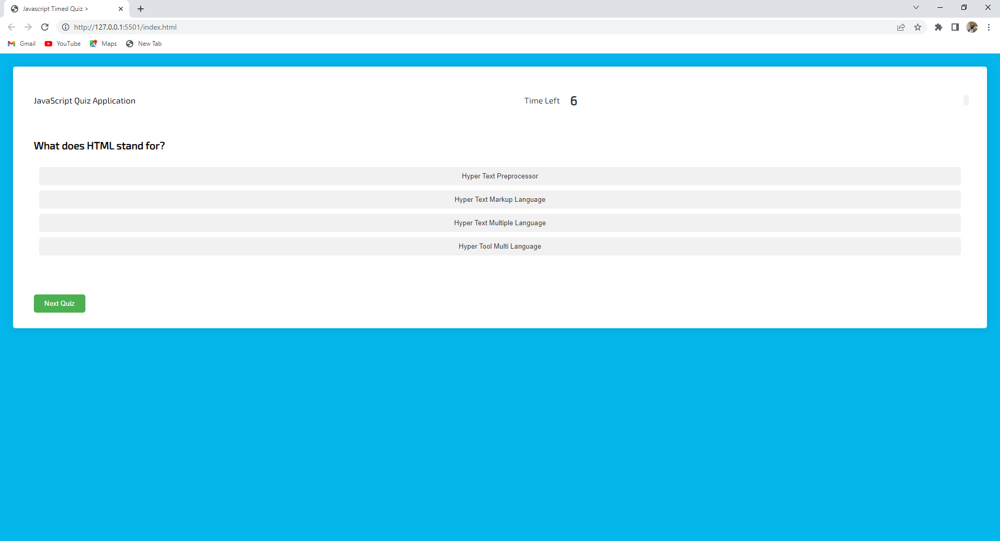
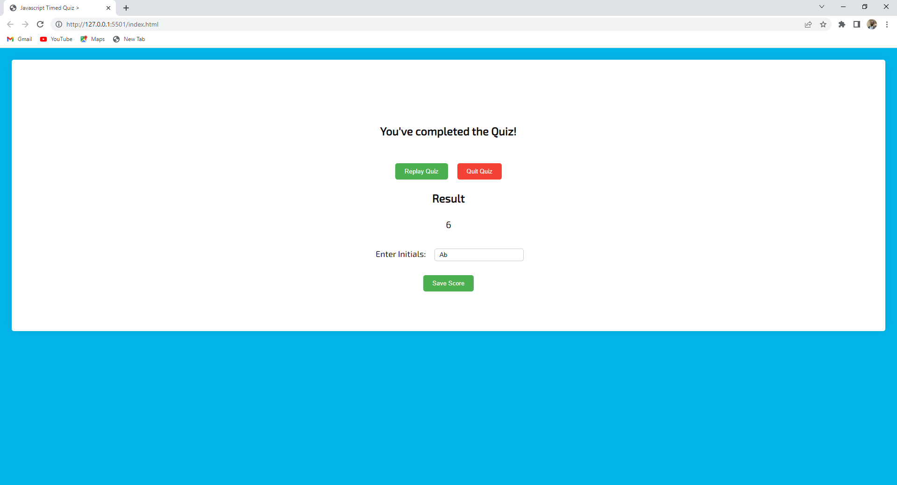

## Description
This timed quiz application has multiple-choice questions. This app will run in the browser and it will feature dynamically updated HTML and CSS powered by Javascript codes. This application was designed to have a simple and responsive user interface that  meet user-defined criteria.

This application was designed to let users take a timed quiz. In the timed quiz, this application should ideally store the scores of each user in localstorage. This was the idea, so that the user can gauge his progress compared to previous users who have taken the timed quiz.

Key features of this project include:

. Timer starts when and you presented with a question.
. You have ten question in total to answer .

**Motivation** 
Firstly, it provides a platform for individuals to learn, practice, and reinforce coding skills in an interactive manner. Secondly, coding quizzes serve as a means of assessing and evaluating coding abilities, whether in educational or job-related settings. Additionally, quizzes bring an element of engagement and fun to coding, with gamified features that keep participants motivated. Moreover, the competitive aspect allows for comparison and benchmarking of performance. Lastly, coding quizzes can be shared to spread knowledge, educate others, and foster community engagement, serving as both a teaching resource and a source of inspiration within the coding community. Overall, coding quizzes combine learning, evaluation, engagement, competition, and knowledge sharing to create a valuable tool for coding education and skill development.

## Installation
. Clone this repository to your local machine or download the source code as a ZIP file and extract it..
. Open the index.html file in a web browser.

 Congratulations! You have successfully launched the Javascript Timed Quiz.

## Usage
Open the index.html file in a web browser

click on the start button 

. Follow the prompt to answer all ten questions before the time elapse.
. Check your score and save score with your initials

 
## Credit 
N/A

## License

MIT License

Copyright (c) 2023 abdulsamedtma

Permission is hereby granted, free of charge, to any person obtaining a copy
---

## Features

Key features of this project include:
. Click on the start buttom to commence 
. Honing your skills and experience in Javacsript 

## How to Contribute

Contributions are always welcome! But please read the contribution guidelines first on [Contributor Covenant](https://www.contributor-covenant.org/).

## Test
Page URL http://127.0.0.1:5501/index.html  Page deployed application URL cominging Soon !

